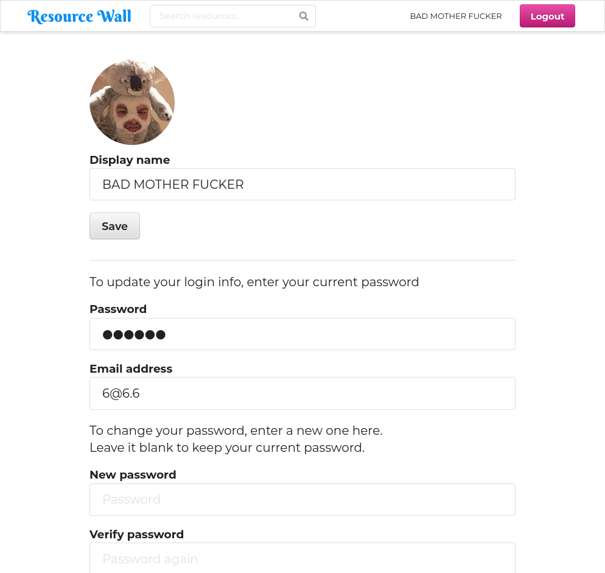
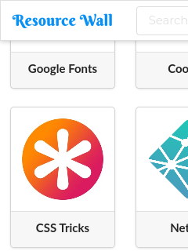

# **Resource Wall**

Resource Wall is a hybrid single-page web app that uses HTML5/SASS->CSS3/jQuery/Fomantic-UI client-side and Node.js/Express/Postgres server-side.  It allows for user sign-up and login, and management of "resources" that are displayed to all users on a feed-style home page.  Categories and search features allow for easy sorting and locating any resource.

This a [Lighthouse Labs](https://www.lighthouselabs.ca/) midterm project by [Ali Sayed](https://github.com/aliyasser20), [Doug Ross](https://github.com/d0ugr), and [Jay Burbyga](https://github.com/Jaybur1).  See [`docs/PROJECT.md`](docs/PROJECT.md) for project notes.

## **Screenshots**

Resource Wall is the most beautiful web app you've ever seen.

Resource Wall being awesome:



Not really usable on a Nokia 8110:



## **Getting Started**

### **Setup**

You will need to install [Node.js](https://nodejs.org) and [Postgres](https://www.postgresql.org/).

Then execute the following to set up Resource Wall:

```
git clone https://github.com/Jaybur1/midterm-resource-hub
cd midterm-resource-hub
npm install
```

Create a database and user in Postgres for Resource Wall to use and edit .env to match your setup.  Then create tables with:

```
node bin/resetdb.js
```

### **Run**

To start normally:

```
npm start
```

Then open http://localhost:8080 in your browser.

## **Development**

### **Directory Structure**

The project files are arranged as follows:

```
./                       Main project repository
./docs                   Project documentation
./db/schema              Database setup files
./db/seeds               Database seed files for development and testing
./lib
./public                 All static files served to the client
./public/assets/images   Static images used on the site
./public/scripts         Client-side JavaScript
./public/styles          Precompiled CSS (auto-generated - do not edit)
./public/vendor          Client-side external JavaScript libraries (CSS and JS)
./server                 Server-side Node.js JavaScript
./server/routes          Express routes
./views                  EJS views for site pages
./views/partials         EJS partial views for site pages
./styles                 SASS style sheets (compiled into public/styles)

Do not edit or push to repo:

./node_modules           Node.js packages
./semantic               Fomantic-UI files
./public/styles          Precompiled CSS
```

### **Dependencies**

Resource Wall requires [Node.js](https://nodejs.org) and [Postgres](https://www.postgresql.org/) and the following [NPM](https://www.npmjs.com/) packages are used:

- [bcrypt](https://www.npmjs.com/package/bcrypt)
- [body-parser](https://www.npmjs.com/package/body-parser)
- [chalk](https://www.npmjs.com/package/chalk)
- [cookie-session](https://www.npmjs.com/package/cookie-session)
- [dotenv](https://www.npmjs.com/package/dotenv)
- [ejs](https://www.npmjs.com/package/ejs)
- [express](https://www.npmjs.com/package/express)
- [fomantic-ui](https://www.npmjs.com/package/fomantic-ui)
- [morgan](https://www.npmjs.com/package/morgan)
- [node-sass-middleware](https://www.npmjs.com/package/node-sass-middleware)
- [pg](https://www.npmjs.com/package/pg)

### **Development Dependencies**

The following NPM packages are used for development:

- [nodemon](https://www.npmjs.com/package/nodemon)

### **Run**

While working on Resource Wall it is preferable to use nodemon to automatically restart the server when files change:

```
npm run local
```

### **Testing**

There are no unit tests at the time.
