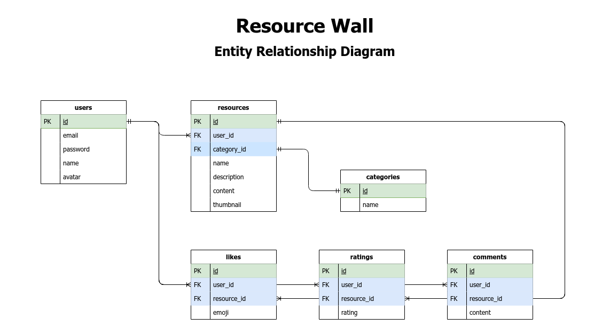

# Table of Contents

- [Project](#project)
  - [Goal](#goal)
  - [Stack Requirements](#stack-requirements)
  - [Optional Requirements](#optional-requirements)
  - [Requirements](#requirements)
- [Design](#design)
  - [User stories](#user-stories)
  - [ERD](#erd)
  - [Wireframe](#wireframe)
  - [Routes](#routes)
    - [UI routes](#ui-routes)
    - [API routes](#api-routes)

# Project

**Option 7: Resource Wall**

Pinterest for learners.

Allow learners to save learning resources like tutorials, blogs and videos in a central place that is publicly available to any user.

## Goal

- Build a web app from start to finish using the tech and approaches learned to date
- Turn requirements into a working product
- Practice architecting an app in terms of UI/UX, Routes/API and Database
- Manage a multi-developer project with git
- Simulate the working world where you do not always get to completely cherry pick your team, stack or product features
- Practice demoing an app to help prepare for the final project and employer interviews

## Stack Requirements

Your projects must use:

- ES6 for server-side (NodeJS) code
- NodeJS
- Express
  - RESTful routes (even if tracking a user session is not RESTful)
- One or more CSS or UI "framework"s:
  - jQuery
  - A CSS preprocessor such as SASS, ~~Stylus, or PostCSS for styling -- or CSS Custom properties and no CSS preprocessor~~
- PostgreSQL and pg (with promises) for DBMS
- git for version control

## Optional Requirements

- SPA (Single-Page Application) Behaviour
- Hosting, such as heroku, netlify, github pages, AWS, or Azure

## Requirements

- users should be able to save an external URL along with a title and description
- users should be able to search for already-saved resources created by any user
- users should be able to categorize any resource under a topic
- users should be able to comment on any resource
- users should be able to rate any resource
- users should be able to like any resource
- users should be able to view all their own and all liked resources on one page ("My resources")
- users should be able to register, log in, log out and update their profile

# Design

## User stories

As a user I want to [be able to] ...

## ERD



- Each table has `created` and `updated` timestamp columns

- `id` column as primary key for `likes`, `ratings`, and `comments` not necessary (use composite primary key from `user_id` and `resource_id`)

## Wireframe


## Routes

### UI routes

```
GET    /            Show main landing page
                    - redirect to /home if already logged in

GET    /login       Show login page
                    - redirect to /home if already logged in
PUT    /login       Log in (create session)
                    - redirect to /home if successful

GET    /signup      Show new user registration page
                    - redirect to /home if already logged in
PUT    /signup      Create a new user account
                    - redirect to /home if successful

PUT    /logout      Log out (destroy session)
                    - redirect to /

GET    /profile     Show user profile page
                    - redirect to / if not logged in
PUT    /profile     Update user profile info
                    - redirect to / if not logged in

GET    /home        Show main resources page
                    - redirect to / if not logged in
```

### API routes

```
GET    /resource    Retrieve a resource
PATCH  /resource    Update a resource
DELETE /resource    Remove a resource

POST   /like        Add a like
DELETE /like        Remove a like

POST   /rating      Add a rating
PATCH  /rating      Update a rating
DELETE /rating      Remove a rating

POST   /comment     Add a comment
PATCH  /comment     Update a comment
DELETE /comment     Remove a comment
```
